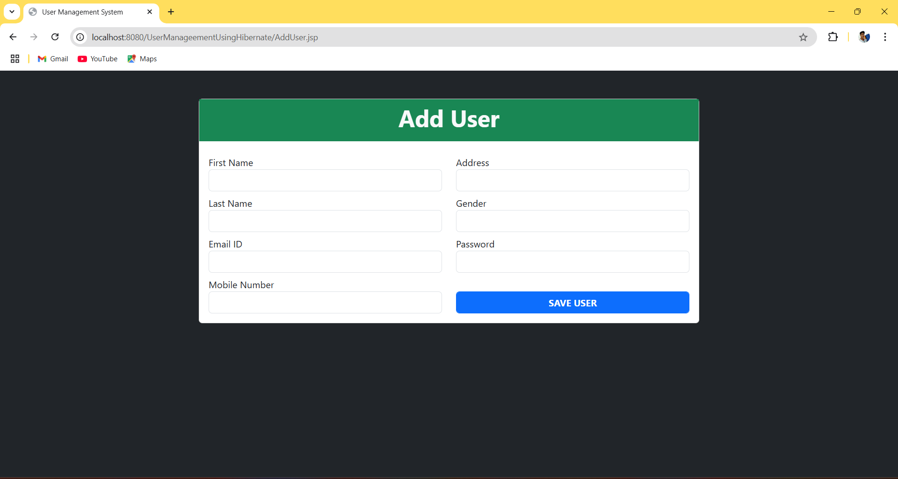
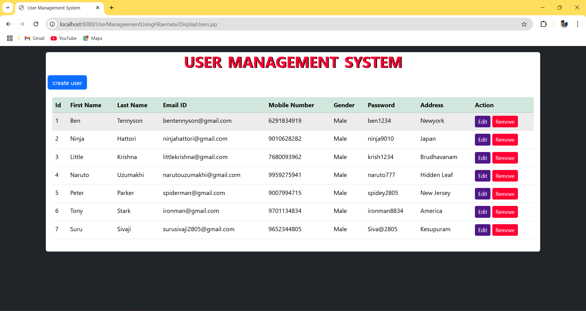
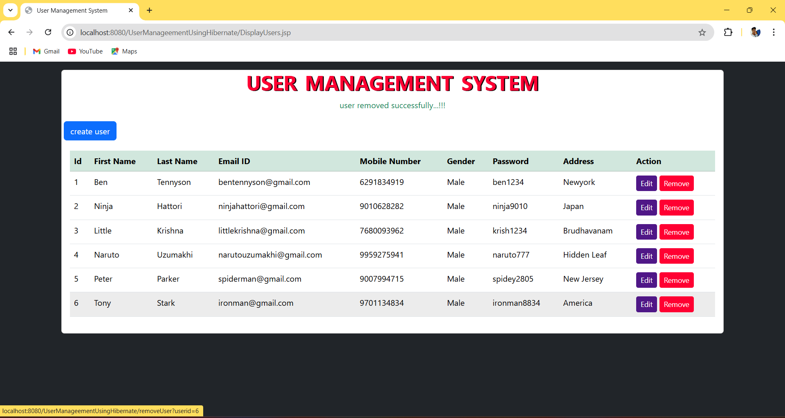

<h2 align="center">USER MANAGEMENT SYSTEM</h2>

It is a crud based application it is developed by using jsp, servlets, hibernate, html, css, bootstrap. It will perform operations like:

<ul>
  <li>add user</li>
  <li>edit user</li>
  <li>remove user</li>
  <li>view all user details</li>
</ul>
<h3 align="center">SCREENSHOTS</h3>

  
  
<b>Add User</b>

  
  
<b>Edit User</b>

  
  
<b>View User Details</b>

  
  
<b>Remove User</b>

